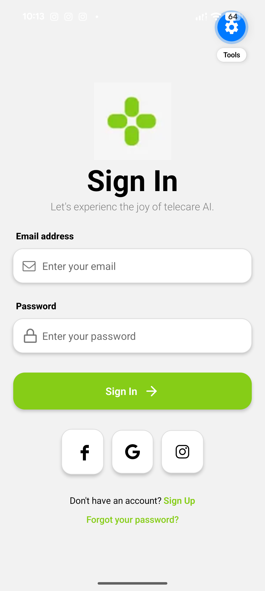
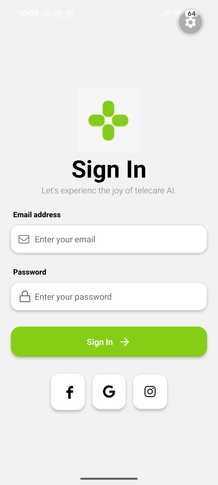
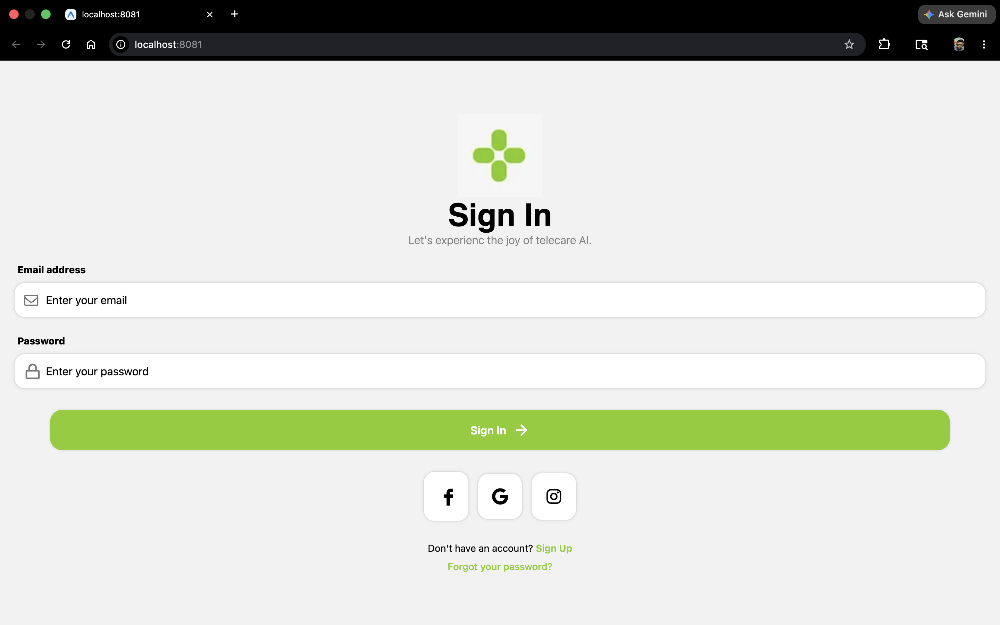

# Sign In Screen

A React Native sign-in screen built with [Expo](https://expo.dev) and [Expo Router](https://docs.expo.dev/router/introduction/). It demonstrates a centered layout with branded header, email and password fields, primary action, social sign-in shortcuts, and footer links.

## Preview

Save captures under [`docs/screenshots/`](docs/screenshots/) using the filenames below, or change the paths in the image markdown to match your files.

### iOS

<!-- Add or replace: docs/screenshots/ios-signin.png -->



### Android

<!-- Add or replace: docs/screenshots/android-signin.png -->



### Web (optional)

<!-- Add or replace: docs/screenshots/web-signin.png -->



## Features

- **Safe area & keyboard** — `SafeAreaView` and `KeyboardAvoidingView` so the form stays usable with the keyboard open on iOS and Android.
- **Form fields** — Email and password inputs with icons (`@expo/vector-icons`).
- **Primary action** — Sign In button with arrow affordance.
- **Social row** — Placeholder buttons for Facebook, Google, and Instagram.
- **Footer** — Sign Up (styled link) and Forgot your password text.

## Tech stack

- [Expo SDK 55](https://docs.expo.dev/)
- [Expo Router](https://docs.expo.dev/router/introduction/) (file-based routing)
- React 19 / React Native 0.83
- TypeScript

## Prerequisites

- [Node.js](https://nodejs.org/) (LTS recommended)
- [npm](https://www.npmjs.com/) (ships with Node)
- For physical devices: [Expo Go](https://expo.dev/go) or a dev build
- For simulators: Xcode (iOS) and/or Android Studio (Android)

## Getting started

Install dependencies:

```bash
npm install
```

Start the development server:

```bash
npm start
```

Then press **i** (iOS simulator), **a** (Android emulator), or scan the QR code with Expo Go. For web:

```bash
npm run web
```

Other scripts:

| Command           | Description              |
| ----------------- | ------------------------ |
| `npm run ios`     | Start with iOS focus     |
| `npm run android` | Start with Android focus |
| `npm run lint`    | Run Expo lint            |

## Project structure

```
signin-screen-project/
├── app.json
├── package.json
├── docs/
│   └── screenshots/       # README preview images (optional)
├── src/
│   └── app/
│       ├── _layout.tsx    # Root layout
│       └── index.tsx      # Sign-in screen
└── assets/                # Images and app icons
```

The main UI lives in `src/app/index.tsx`.

## Learn more

- [Expo documentation](https://docs.expo.dev/)
- [React Native documentation](https://reactnative.dev/docs/getting-started)
